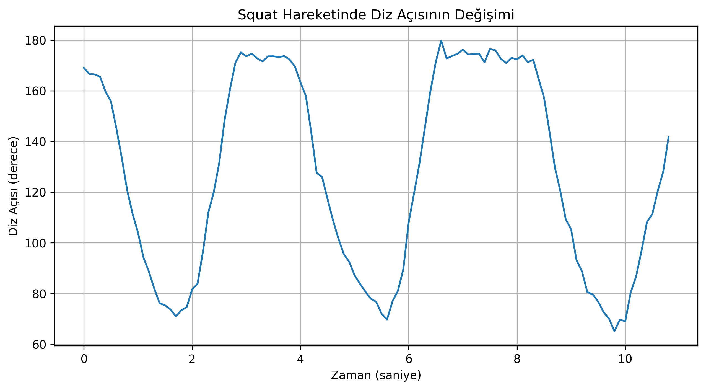
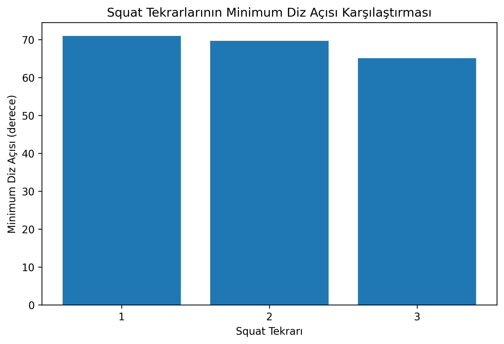

# Sports Motion Analyzer

Bu proje, bir spor videosundaki squat hareketini temel bilgisayarlı görü ve veri analizi yöntemleriyle inceleyen bir prototiptir.

Projenin amacı; videodan insan vücut noktalarını tespit etmek, diz açısının hareket boyunca nasıl değiştiğini ölçmek, squat tekrarlarını yaklaşık olarak belirlemek ve elde edilen verileri grafiklerle incelemektir.

## Projenin Amacı

Spor performansının yalnızca gözlem yoluyla değil, video üzerinden elde edilen sayısal verilerle de incelenebileceği basit bir prototip geliştirmek.

Bu kapsamda:

* Videodaki insan vücut noktaları tespit edildi.
* Kalça, diz ve ayak bileği koordinatları kullanıldı.
* Diz açısı hesaplandı.
* Diz açısının zaman içerisindeki değişimi analiz edildi.
* Squat tekrarları yaklaşık olarak tespit edildi.
* Tekrarların minimum diz açıları karşılaştırıldı.

##  Kullanılan Teknolojiler

* Python
* MediaPipe Pose Landmarker
* OpenCV
* NumPy
* Pandas
* Matplotlib
* SciPy
* Google Colab

## Analiz Akışı

```text
Video
  ↓
Pose Detection
  ↓
Vücut Noktalarının Tespiti
  ↓
Diz Açısı Hesaplama
  ↓
Zaman Serisi Analizi
  ↓
Squat Tekrarlarının Yaklaşık Tespiti
  ↓
Grafikler ve Özet Sonuçlar
```

## Yapılan Analiz

Test videosu yaklaşık **11 saniye** uzunluğundadır.

Video 30 FPS olarak analiz edilmiş ve her 3 kareden birinde ölçüm alınarak toplam **109 ölçüm** elde edilmiştir.

Analiz sonucunda:

* Yaklaşık squat sayısı: **3**
* Ortalama minimum diz açısı: **68.61°**
* En düşük diz açısı: **65.13°**
* En düşük açıya ulaşılan zaman: **9.8 saniye**
* İlk squat minimum açısı: **70.98°**
* Son squat minimum açısı: **65.13°**

İlk ve son squat arasındaki minimum açı değişimi yaklaşık **-%8.24** olarak hesaplanmıştır.

Bu değer, tek başına performans artışı veya düşüşü olarak yorumlanmamaktadır. Yalnızca analiz edilen videodaki ölçüm değerlerinin değişimini göstermektedir.

##  Sonuçlar

### Diz Açısının Zaman İçindeki Değişimi



Grafik, squat hareketi boyunca diz açısının zaman içerisindeki değişimini göstermektedir.

### Squat Tekrarlarının Karşılaştırılması



Bu grafik, tespit edilen her squat tekrarındaki minimum diz açılarını karşılaştırmaktadır.

##  Proje Kapsamı

Bu çalışma bir **MVP (Minimum Viable Product)** / prototip olarak geliştirilmiştir.

Amaç profesyonel bir spor analiz sistemi oluşturmak değil, video verisinden anlamlı bir ölçüm üretme sürecini uygulamalı olarak göstermektir.

##  Sınırlılıklar

* Analiz yalnızca tek bir video üzerinden gerçekleştirilmiştir.
* Diz açısı 2 boyutlu görüntü koordinatları üzerinden hesaplanmıştır.
* Kamera açısı ve kişinin görüntüdeki konumu sonucu etkileyebilir.
* Analiz yalnızca seçilen vücut noktaları üzerinden yapılmıştır.
* Squat tekrarlarının tespiti yaklaşık bir yöntemle gerçekleştirilmiştir.
* Sistem tıbbi değerlendirme veya profesyonel spor performansı değerlendirmesi amacıyla kullanılmamalıdır.

##  Gelecekte Geliştirilebilecek Özellikler

Projenin ilerleyen aşamalarında:

* Farklı squat tekniklerinin analiz edilmesi
* Daha fazla vücut açısının hesaplanması
* Farklı spor hareketlerinin desteklenmesi
* Tekrarların daha gelişmiş yöntemlerle tespit edilmesi
* Kullanıcı geçmişinin tutulması
* Performans değişiminin zaman içerisinde karşılaştırılması
* Web tabanlı bir analiz arayüzü oluşturulması
* Sporcu ve antrenörler için basit bir raporlama paneli geliştirilmesi

gibi özellikler eklenebilir.

##  Proje Yapısı

```text
Sports-Motion-Analyzer/
│
├── README.md
│
└── Sports-Motion-Analyzer/
    ├── Sports_Motion_Analyzer.ipynb
    │
    ├── data/
    │   ├── squat_knee_angle_analysis.csv
    │   └── squat_analysis_summary.csv
    │
    └── results/
        ├── knee_angle_over_time.png
        └── squat_comparison.png
```

##  Proje Notu

Bu proje, Yönetim Bilişim Sistemleri kapsamında veri analizi, yapay zekâ ve bilgisayarlı görü teknolojilerinin gerçek bir problem alanına uygulanmasını deneyimlemek amacıyla geliştirilmiş bir prototiptir.
## 📊 Proje Sunumu

[Sports Motion Analyzer — Sunumu Görüntüle](Sports-Motion-Analyzer/presentation/Sports_Motion_Analyzer_Sunum.pdf)

